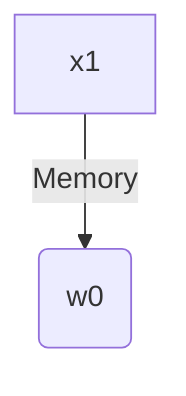
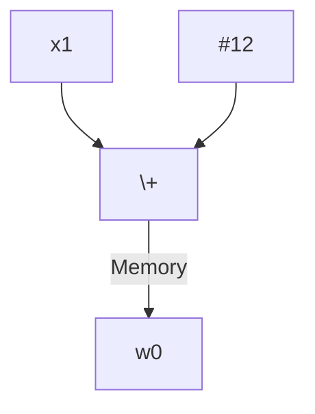
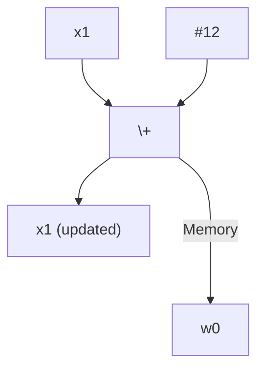
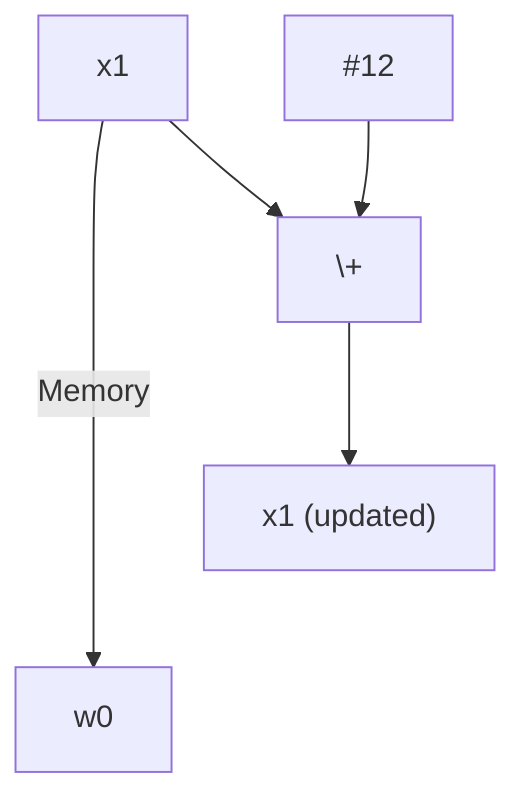

# arm64 ASM Cheatsheet

## Registers

Register | Special | Role in the procedure call standard
-- | -- | --
SP |   | The Stack Pointer
r30 | LR | The Link Register (contains the return address)
r29 | FP | The Frame Pointer
r19…r28 |   | Callee-saved registers
r18 |   | The Platform Register. Apple reserves this register
r17 | IP1 | The second intra-procedure-call temporary register (can be used by call veneers and PLT code); at other times may be used as a temporary register
r16 | IP0 | The first intra-procedure-call scratch register (can be used by call veneers and PLT code); at other times may be used as a temporary register
r9…r15 |   | Temporary registers
r8 |   | Indirect result location register
r0…r7 |   | Parameter/result registers

## Calling Convention

### Arguments

```c
void calling_convention_args(
    uint8_t reg1,
    uint16_t reg2,
    uint32_t reg3,
    uint64_t reg4,
    uint64_t reg5,
    uint64_t reg6,
    uint64_t reg7,
    uint64_t reg8,

    uint8_t stack1,
    uint16_t stack2,
    uint32_t stack3,
    uint64_t stack4
);

void my_function(void) {
    calling_convention_args(
        0x11,
        0x1122,
        0x11223344,
        0x1122334455667788,
        0x2233445566778899,
        0x33445566778899AA,
        0x445566778899AABB,
        0x5566778899AABBCC,

        0xAA,
        0xAABB,
        0xAABBCCDD,
        0xAABBCCDDEEFF1122
    );
}
```

```assembly
; The first 8 arguments are stored into the register
mov     w0, #0x11               ; 1st Argument
mov     w1, #0x1122             ; 2nd Argument
mov     w2, #0x3344             ; 3rd Argument (0x1122|3344)
movk    w2, #0x1122, lsl #16
mov     x3, #0x7788             ; 4th Argument (0x1122|3344|5566|7788)
movk    x3, #0x5566, lsl #16
movk    x3, #0x3344, lsl #32
movk    x3, #0x1122, lsl #48
mov     x4, #0x8899             ; 5th Argument (0x2233|4455|6677|8899)
movk    x4, #0x6677, lsl #16
movk    x4, #0x4455, lsl #32
movk    x4, #0x2233, lsl #48
mov     x5, #0x99aa             ; 6th Argument (0x3344|5566|7788|99AA)
movk    x5, #0x7788, lsl #16
movk    x5, #0x5566, lsl #32
movk    x5, #0x3344, lsl #48
mov     x6, #0xaabb             ; 7th Argument (0x4455|6677|8899|AABB)
movk    x6, #0x8899, lsl #16
movk    x6, #0x6677, lsl #32
movk    x6, #0x4455, lsl #48
mov     x7, #0xbbcc             ; 8th Argument (0x5566|7788|99AA|BBCC)
movk    x7, #0x99aa, lsl #16
movk    x7, #0x7788, lsl #32
movk    x7, #0x5566, lsl #48

; The stack must be aligned by 16 bytes
sub     sp, sp, #0x10

; Additional values are stored in the stack
mov     x8, #0x1122             ; 12th argument (0xAABB|CCDD|EEFF|1122)
movk    x8, #0xeeff, lsl #16
movk    x8, #0xccdd, lsl #32
movk    x8, #0xaabb, lsl #48
str     x8, [sp, #0x8]
mov     w8, #0xccdd             ; 11th argument (0xAABB|CCDD)
movk    w8, #0xaabb, lsl #16
str     w8, [sp, #0x4]
mov     w8, #0xaabb             ; 10th argument
strh    w8, [sp, #0x2]
mov     w8, #0xaa               ; 9th argument
strb    w8, [sp]
```

#### A Deeper Dive To Stack Alignment

I created a table to better visualise the alignment for additional arguments that are stored in the stack.

```
╔══════╦══════╦══════╦══════╦══════╦══════╦══════╦══════╦══════╦══════╦══════╦══════╦══════╦══════╦══════╦══════╗
║ 0x00 ║ 0x01 ║ 0x02 ║ 0x03 ║ 0x04 ║ 0x05 ║ 0x06 ║ 0x07 ║ 0x08 ║ 0x09 ║ 0x0A ║ 0x0B ║ 0x0C ║ 0x0D ║ 0x0E ║ 0x0F ║
╠══════╬══════╬══════╬══════╬══════╬══════╬══════╬══════╬══════╬══════╬══════╬══════╬══════╬══════╬══════╬══════╣
║ int8 ║ int8 ║ int8 ║ int8 ║ int8 ║ int8 ║ int8 ║ int8 ║ int8 ║ int8 ║ int8 ║ int8 ║ int8 ║ int8 ║ int8 ║ int8 ║
╠══════╩══════╬══════╩══════╬══════╩══════╬══════╩══════╬══════╩══════╬══════╩══════╬══════╩══════╬══════╩══════╣
║ int16       ║ int16       ║ int16       ║ int16       ║ int16       ║ int16       ║ int16       ║ int16       ║
╠═════════════╩═════════════╬═════════════╩═════════════╬═════════════╩═════════════╬═════════════╩═════════════╣
║ int32                     ║ int32                     ║ int32                     ║ int32                     ║
╠═══════════════════════════╩═══════════════════════════╬═══════════════════════════╩═══════════════════════════╣
║ int64                                                 ║ int64                                                 ║
╠═══════════════════════════════════════════════════════╩═══════════════════════════════════════════════════════╣
║                                     The stack must be aligned by 16 bytes                                     ║
╚═══════════════════════════════════════════════════════════════════════════════════════════════════════════════╝
```

Take notice on where the second stack argument is located on the stack

```c
calling_convention_stackalignment_imperfect_int8_int16(
    4, 4, 4, 4, 4, 4, 4, 4,

    0xA,
    0xB
);

calling_convention_stackalignment_imperfect_int8_int32(
    5, 5, 5, 5, 5, 5, 5, 5,

    0xC,
    0xD
);

calling_convention_stackalignment_imperfect_int8_int64(
    6, 6, 6, 6, 6, 6, 6, 6,

    0xE,
    0xF
);
```

```assembly
;
; Arguments For `_calling_convention_stackalignment_imperfect_int8_int16`
;

mov     w0, #0x4
; ...

mov     w8, #0xb
mov     w9, #0xa
strh    w8, [sp, #0x2]  ; The int16 argument is aligned to 0x02
strb    w9, [sp]


;
; Arguments For `_calling_convention_stackalignment_imperfect_int8_int32`
;

mov     w0, #0x5
; ...

mov     w8, #0xd
mov     w9, #0xc
str     w8, [sp, #0x4]  ; The int32 argument is aligned to 0x04
strb    w9, [sp]


;
; Arguments For `_calling_convention_stackalignment_imperfect_int8_int64`
;

mov     w0, #0x6
; ...

mov     w8, #0xf
mov     w9, #0xe
str     x8, [sp, #0x8]  ; The int64 argument is aligned to 0x08
strb    w9, [sp]
```

### Return Arguments

```c
uint8_t calling_convention_retarg_uint8(void) {
    return 0x11;
}

uint16_t calling_convention_retarg_uint16(void) {
    return 0x11AA;
}

uint32_t calling_convention_retarg_uint32(void) {
    return 0x11AA22BB;
}

uint64_t calling_convention_retarg_uint64(void) {
    return 0x11AA22BB33CC44DD;
}

__uint128_t calling_convention_retarg_uint128(void) {
    __uint128_t result;
    result = 0x11AA22BB33CC44DD;
    result = (result << 64) + 0x55EE66FF77AA88BB;
    return result;
}
```

```assembly
; arm64 has two return registers
; --> x0 - First return argument
; --> x1 - Second return argument

_calling_convention_retarg_uint8:
00000000000002f4        mov     w0, #0x11
00000000000002f8        ret

_calling_convention_retarg_uint16:
00000000000002fc        mov     w0, #0x11aa
0000000000000300        ret

_calling_convention_retarg_uint32:
0000000000000304        mov     w0, #0x22bb
0000000000000308        movk    w0, #0x11aa, lsl #16
000000000000030c        ret

_calling_convention_retarg_uint64:
0000000000000310        mov     x0, #0x44dd
0000000000000314        movk    x0, #0x33cc, lsl #16
0000000000000318        movk    x0, #0x22bb, lsl #32
000000000000031c        movk    x0, #0x11aa, lsl #48
0000000000000320        ret

_calling_convention_retarg_uint128:
mov     x0, #0x88bb                 
movk    x0, #0x77aa, lsl #16
movk    x0, #0x66ff, lsl #32
movk    x0, #0x55ee, lsl #48
mov     x1, #0x44dd
movk    x1, #0x33cc, lsl #16
movk    x1, #0x22bb, lsl #32
movk    x1, #0x11aa, lsl #48
ret
```

### Creating And Calling A Function

```
_caller_function:
    ; If you plan on calling any additional functions, you
    ; must preserve the link and frame register.
    sub     sp, sp, #0x10
    stp     fp, lr, [sp]
    
    ; Some functions can use the stack to preserve values or
    ; to hold additional function arguments. It's important
    ; that the stack is always aligned by 16 bytes.
    sub     sp, sp, #0x10

    ; Function Arguments
    mov     w0, #0x0
    mov     w1, #0x1
    mov     w2, #0x2
    mov     w3, #0x3
    mov     w4, #0x4
    mov     w5, #0x5
    mov     w6, #0x6
    mov     w7, #0x7

    mov     w8, #0x8
    str     x8, [sp]

    ; The branch and link instruction will set the return
    ; address in the link register.
    bl      _callee_function
    
    ; If you borrow from the stack, you must restore the
    ; stack to it's original position.
    add     sp, sp, #0x10

    ; Restore the frame and link register to their original
    ; value
    ldp     fp, lr, [sp, #0x10]
    add     sp, sp, #0x10

    ; If you called any functions and didn't restore the
    ; original link register, you will risk an infinite
    ; loop occuring.
    ret
```

## General

### Grabbing Variable Address

```
    adrp    x0, variable@PAGE
    add     x0, x0, variable@PAGEOFF
```

### Loads and Stores Addressing

* Base register
```assembly
; x1 stays the same
; w0 = x1[0]
ldr w0, [x1]
```


* Offset addressing modes
```assembly
; x1 stays the same
; w0 = x1[12]
ldr w0, [x1, #12]
```


* Pre-index addressing modes
```assembly
; x1 updated to x1 + 12
; w0 = x1[12]
ldr w0, [x1, #12]!
```


* Post-index addressing modes
```assembly
; x1 updated to x1 + 12
; w0 = x1[0]
ldr w0, [x1], #12
```


## Sources

* Procedure Call Standard for the Arm® 64-bit Architecture (AArch64)
  * [General Purpose Registers](https://github.com/ARM-software/abi-aa/blob/main/aapcs64/aapcs64.rst#611general-purpose-registers)
  * [A64 -- Base Instructions](https://developer.arm.com/documentation/ddi0602/2023-06/Base-Instructions)
* ARM Cortex-A Series Programmer's Guide for ARMv8-A
  * [Conditional instructions](https://developer.arm.com/documentation/den0024/a/The-A64-instruction-set/Data-processing-instructions/Conditional-instructions)
* [AArch64 Exception Levels](https://krinkinmu.github.io/2021/01/04/aarch64-exception-levels.html)
* Learn the architecture - AArch64 Exception Model
  * [Exception levels](https://developer.arm.com/documentation/102412/0103/Privilege-and-Exception-levels/Exception-levels?lang=en)
* Learn the architecture - A64 Instruction Set Architecture
  * [Loads and stores - addressing](https://developer.arm.com/documentation/102374/0101/Loads-and-stores---addressing)
* [Arm NEON programming quick reference](https://community.arm.com/arm-community-blogs/b/operating-systems-blog/posts/arm-neon-programming-quick-reference)
* [Writing ARM64 code for Apple platforms](https://developer.apple.com/documentation/xcode/writing-arm64-code-for-apple-platforms)
* A64 General Instructions
  * [`BL` instruction](https://developer.arm.com/documentation/dui0802/a/A64-General-Instructions/BL)
  